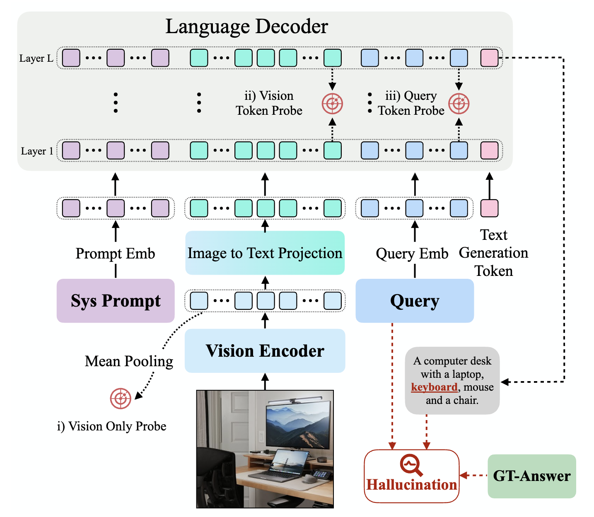
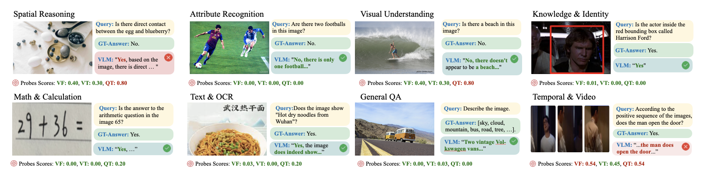

<p align="center">
  <h1 align="center">HALP: Detecting Hallucinations in Vision-Language Models<br>without Generating a Single Token</h1>
</p>

<p align="center">
  <a href="https://github.com/Zesearch/HALP"></a>
  <a href="https://arxiv.org/abs/2603.05465"></a>
  <a href="#"></a>
  <a href="https://opensource.org/licenses/MIT"></a>
  <a href="https://www.python.org/downloads/release/python-3100/"></a>
  <a href="https://pytorch.org/"></a>
  <a href="https://huggingface.co/"></a>
</p>

<p align="center">
  <b>Sai Akhil Kogilathota<sup>1</sup></b> &nbsp;&nbsp;
  <b>Sripadha Vallabha E G<sup>1</sup></b> &nbsp;&nbsp;
  <b>Luzhe Sun<sup>2</sup></b> &nbsp;&nbsp;
  <b>Jiawei Zhou<sup>1</sup></b>
</p>

<p align="center">
  <sup>1</sup>Stony Brook University &nbsp;&nbsp;
  <sup>2</sup>Toyota Technological Institute at Chicago
</p>

<p align="center">
  <a href="mailto:saiakhil.kogilathota@stonybrook.edu">saiakhil.kogilathota@stonybrook.edu</a> &nbsp;|&nbsp;
  <a href="mailto:sripadhavallab.eg@stonybrook.edu">sripadhavallab.eg@stonybrook.edu</a> &nbsp;|&nbsp;
  <a href="mailto:luzhesun@ttic.edu">luzhesun@ttic.edu</a> &nbsp;|&nbsp;
  <a href="mailto:jiawei.zhou.1@stonybrook.edu">jiawei.zhou.1@stonybrook.edu</a>
</p>

---

## TL;DR

**HALP** predicts whether a Vision-Language Model will hallucinate *before generating a single token* by probing internal representations. Using lightweight MLP probes on pre-generation features, we achieve up to **0.93 AUROC** across 8 modern VLMs including Gemma-3, Phi-4-VL, LLaVA, and Llama-3.2-Vision—enabling real-time risk assessment without costly decoding.

---

## Highlights

| | Contribution |
|:---:|:---|
| **Pre-Generation Detection** | Detect hallucination risk from internal VLM states in a *single forward pass*—no token generation required |
| **Three Probe Types** | Systematically analyze Visual Features (VF), Vision Tokens (VT), and Query Tokens (QT) across decoder layers |
| **8 State-of-the-Art VLMs** | Comprehensive evaluation on Gemma-3-12B, Phi-4-VL, LLaVA-Next, Molmo, Qwen2.5-VL, Llama-3.2-Vision, SmolVLM, and FastVLM |
| **Diverse Benchmark** | 10,000-sample dataset from 6 established benchmarks covering object, attribute, relationship, and reasoning hallucinations |

---

## Method Overview

<p align="center">
  
</p>


HALP extracts three types of internal representations from a single forward pass:

| Representation | Symbol | Description | Extraction Point |
|:---|:---:|:---|:---|
| **Visual Features** | VF | Mean-pooled vision encoder output | Before multimodal projection |
| **Vision Token** | VT | Hidden states at final vision token position | Decoder layers {1, L/4, L/2, 3L/4, L} |
| **Query Token** | QT | Hidden states at final query token position | Decoder layers {1, L/4, L/2, 3L/4, L} |

Each representation is fed to a lightweight **3-layer MLP probe** (512→256→128→1) trained with binary cross-entropy to predict hallucination occurrence.

---

## Main Results

### Overall Performance (Test AUROC)

| Model | VF | VT | QT | Best |
|:---|:---:|:---:|:---:|:---:|
| **Gemma3-12B** | 0.6736 | 0.5956 | **0.9349** | QT Layer L |
| **FastVLM-7B** | 0.6830 | **0.7028** | 0.6136 | VT Layer L |
| **LLaVA-Next-8B** | 0.6108 | 0.6270 | **0.9026** | QT Layer 3L/4 |
| **Molmo-7B** | 0.6830 | 0.6867 | **0.9193** | QT Layer L/2 |
| **Qwen2.5-VL-7B** | 0.7873 | 0.6683 | **0.9150** | QT Layer 3L/4 |
| **Llama-3.2-11B-Vision** | 0.7703 | 0.7377 | **0.8959** | QT Layer L/2 |
| **Phi4-VL-5.6B** | 0.6166 | 0.7738 | **0.9033** | QT Layer 3L/4 |
| **SmolVLM2-2.2B** | 0.7238 | 0.6894 | **0.9014** | QT Layer 3L/4 |
| **Average** | 0.6935 | 0.6852 | **0.8733** | — |

### Key Findings

1. **Query tokens dominate**: QT representations achieve the highest AUROC (avg 0.87) across 7/8 models
2. **Late layers are most predictive**: Optimal QT performance typically at layers 3L/4 or L
3. **Architectural heterogeneity**: Some models (Qwen2.5-VL, Llama-3.2) show strong VF performance (~0.77-0.79), suggesting vision-centric grounding
4. **FastVLM is unique**: Only model where VT outperforms QT, indicating different fusion dynamics

---

## Qualitative Examples

<p align="center">
  
</p>

---

## HALP-Bench Dataset

A diverse 10,000-sample benchmark assembled from 6 established VQA datasets:

| Dataset | Focus | Samples | % |
|:---|:---|:---:|:---:|
| [AMBER](https://github.com/junyangwang0410/AMBER) | Discriminative tasks, attributes | 3,926 | 39.3% |
| [HaloQuest](https://github.com/google/haloquest) | Adversarial challenges | 2,784 | 27.8% |
| [POPE](https://github.com/RUCAIBox/POPE) | Object hallucination | 1,230 | 12.3% |
| [MME](https://github.com/BradyFU/Awesome-Multimodal-Large-Language-Models) | Multimodal reasoning | 885 | 8.9% |
| [HallusionBench](https://github.com/tianyi-lab/HallusionBench) | Visual illusions | 617 | 6.2% |
| [MathVista](https://mathvista.github.io/) | Mathematical reasoning | 558 | 5.6% |
| **Total** | | **10,000** | **100%** |

### Distribution Breakdown

<table>
<tr>
<td width="33%">

**Task Domains**
| Domain | % |
|:---|:---:|
| Attribute Recognition | 30.1% |
| Visual Understanding | 29.8% |
| Spatial Reasoning | 17.7% |
| Knowledge & Identity | 6.5% |
| Math & Calculation | 6.3% |
| Text & OCR | 5.1% |
| General QA | 2.7% |
| Temporal & Video | 1.7% |

</td>
<td width="33%">

**Answer Types**
| Type | % |
|:---|:---:|
| Yes/No | 65.7% |
| Open-Ended | 20.1% |
| Unanswerable | 7.3% |
| Numeric | 6.6% |
| Selection | 0.4% |

</td>
<td width="33%">

**Hallucination Types**
| Type | % |
|:---|:---:|
| Object-related | 34.9% |
| Other errors | 31.7% |
| Relationship-based | 17.2% |
| Attribute-related | 16.2% |

</td>
</tr>
</table>

---

## Supported Models

| Model | Parameters | Vision Encoder | HuggingFace |
|:---|:---:|:---|:---|
| **Gemma3-12B** | 12.2B | SigLIP | [google/gemma-3-12b-it](https://huggingface.co/google/gemma-3-12b-it) |
| **FastVLM-7B** | 7B | FastViT | [apple/FastVLM-7B](https://huggingface.co/apple/FastVLM-7B) |
| **LLaVA-1.5-8B** | 7.6B | CLIP ViT-L/14 | [llava-hf/llava-1.5-7b-hf](https://huggingface.co/llava-hf/llava-1.5-7b-hf) |
| **Molmo-7B** | 7.2B | OpenAI CLIP | [allenai/Molmo-7B-O-0924](https://huggingface.co/allenai/Molmo-7B-O-0924) |
| **Qwen2.5-VL-7B** | 7B | ViT (window attn) | [Qwen/Qwen2.5-VL-7B-Instruct](https://huggingface.co/Qwen/Qwen2.5-VL-7B-Instruct) |
| **Llama-3.2-11B-Vision** | 10.6B | ViT-H/14 | [meta-llama/Llama-3.2-11B-Vision-Instruct](https://huggingface.co/meta-llama/Llama-3.2-11B-Vision-Instruct) |
| **Phi4-VL-5.6B** | 5.6B | SigLIP-400M | [microsoft/Phi-4-multimodal-instruct](https://huggingface.co/microsoft/Phi-4-multimodal-instruct) |
| **SmolVLM2-2.2B** | 2.2B | SigLIP-400M | [HuggingFaceTB/SmolVLM2-2.2B-Instruct](https://huggingface.co/HuggingFaceTB/SmolVLM2-2.2B-Instruct) |

---

## Installation

### Requirements
- Python 3.10+
- PyTorch 2.0+ with CUDA 11.8+
- GPU: NVIDIA RTX 4090 (24GB VRAM) recommended

### Environment Setup

```bash
# Clone the repository
git clone https://github.com/Zesearch/HALP.git
cd HALP

# Create conda environment
conda create -n halp python=3.10
conda activate halp

# Install PyTorch (CUDA 11.8)
pip install torch torchvision --index-url https://download.pytorch.org/whl/cu118

# Install dependencies
pip install transformers accelerate h5py pandas numpy scikit-learn matplotlib seaborn tqdm

# Model-specific dependencies
pip install num2words sentencepiece pillow
```

---

## Quick Start

### 1. Extract Embeddings

Extract internal representations from a VLM (example: SmolVLM):

```bash
cd Extraction_Script

python run_smol_extraction.py \
    --csv-path ../FInal_CSV_Hallucination/smolvlm_manually_reviewed.csv \
    --images-dir ../HALP_Bench \
    --output-dir ../Model_Outputs/Smol/smolvlm_output \
    --checkpoint-interval 1000
```

### 2. Train Probes

Train hallucination detection probes on extracted embeddings:

```bash
cd Secondary_Scripts/probe_training_scripts_results/smolvlm_model_probe

# Train all 11 probes (1 VF + 5 VT + 5 QT)
python run_all_probes.py
```

### 3. Evaluate Results

```bash
# Compile AUROC results
python compile_auroc_results.py

# View summary
cat results/test_auroc_summary.csv
```

---

## Repository Structure

```
HALP/
├── Extraction_Script/                    # Embedding extraction scripts
│   ├── run_gemma3_extraction.py
│   ├── run_fastvlm_extraction.py
│   ├── run_llava_extraction.py
│   ├── run_llama_extract.py
│   ├── run_molmo_extraction_rtx4090.py
│   ├── run_qwen25vl_extraction.py
│   ├── run_phi4_extract.py
│   └── run_smol_extraction.py
│
├── Model_Outputs/                        # Per-model embeddings (HDF5)
│   ├── Gemma_3/
│   ├── FastVLM/
│   ├── LLaVa/
│   ├── LLama_32/
│   ├── Molmo_V1/
│   ├── Phi4_VL/
│   ├── Qwen25_VL/
│   └── Smol/
│
├── FInal_CSV_Hallucination/              # Manually reviewed labels
│   ├── gemma3_manually_reviewed.csv
│   ├── fastvlm_manually_reviewed.csv
│   ├── llava_manually_reviewed.csv
│   ├── molmo_manually_reviewed.csv
│   ├── qwen25vl_manually_reviewed.csv
│   ├── llama32_manually_reviewed.csv
│   ├── phi4vl_manually_reviewed.csv
│   └── smolvlm_manually_reviewed.csv
│
├── HALP_Bench/                           # Benchmark images (4,852 files)
│
├── Secondary_Scripts/
│   ├── probe_training_scripts_results/   # Probe training per model
│   │   ├── gemma_model_probe/
│   │   ├── fastvlm_model_probe/
│   │   ├── llava_model_probe/
│   │   ├── molmo_model_probe/
│   │   ├── qwen25vl_model_probe/
│   │   ├── llama32_model_probe/
│   │   ├── phi4vl_model_probe/
│   │   └── smolvlm_model_probe/
│   ├── probe_analysis/                   # Cross-model analysis
│   └── detailed_probe_analysis/          # Per-category analysis
│
├── assets/                               # Figures for README
│   ├── halp_pipeline.png
│   └── qualitative_examples.png
│
├── EACL_HALP_Camera_Ready.pdf            # Research paper
├── project.md                            # Detailed project documentation
└── README.md                             # This file
```

---

## Detailed Usage

### Embedding Extraction

Each model has a dedicated extraction script. The general workflow:

```python
# Example: Extract embeddings from Gemma-3-12B
python Extraction_Script/run_gemma3_extraction.py \
    --csv-path FInal_CSV_Hallucination/gemma3_manually_reviewed.csv \
    --images-dir HALP_Bench \
    --output-dir Model_Outputs/Gemma_3/gemma_output \
    --checkpoint-interval 1000
```

**Output format** (HDF5):
```
sample_id/
├── vision_only_representation        # [D_vision]
├── vision_token_layer_0              # [D_hidden]
├── vision_token_layer_L4             # [D_hidden]
├── vision_token_layer_L2             # [D_hidden]
├── vision_token_layer_3L4            # [D_hidden]
├── vision_token_layer_L              # [D_hidden]
├── query_token_layer_0               # [D_hidden]
├── query_token_layer_L4              # [D_hidden]
├── query_token_layer_L2              # [D_hidden]
├── query_token_layer_3L4             # [D_hidden]
├── query_token_layer_L               # [D_hidden]
└── metadata (question, gt_answer, model_answer, image_name)
```

### Probe Training

Navigate to the model-specific probe directory:

```bash
cd Secondary_Scripts/probe_training_scripts_results/gemma_model_probe

# Train individual probes
python 01_vision_only_probe.py           # Visual Features probe
python 02-06_vision_token_probes.py      # Vision Token probes (5 layers)
python 07-11_query_token_probes.py       # Query Token probes (5 layers)

# Or train all probes at once
python run_all_probes.py
```

**Probe Architecture**:
```
Input [D_hidden] → Linear(512) → ReLU → BN → Dropout(0.3)
               → Linear(256) → ReLU → BN → Dropout(0.3)
               → Linear(128) → ReLU → BN → Dropout(0.3)
               → Linear(1) → Sigmoid
```

**Training Config**: Adam (lr=0.001), batch size 32, 50 epochs, BCE loss

### Cross-Model Analysis

```bash
cd Secondary_Scripts/probe_analysis

# Run comprehensive analysis across all models
python analyze_all_models.py

# Category-specific analysis
python analyze_probe_by_category.py
```

---

## Compute Requirements

| Task | GPU | VRAM | Time (per model) |
|:---|:---|:---|:---|
| Embedding Extraction | RTX 4090 | 24GB | 3-6 hours |
| Probe Training (11 probes) | RTX 4090 | 4GB | 10-15 minutes |
| Total (8 models) | — | — | ~10 GPU-hours |

---


## Acknowledgments

We thank the developers of:
- **[PyTorch](https://pytorch.org/)** and **[HuggingFace Transformers](https://huggingface.co/transformers/)** for the deep learning infrastructure
- **[Google](https://huggingface.co/google)** (Gemma), **[Meta](https://huggingface.co/meta-llama)** (LLaMA, LLaVA), **[Alibaba](https://huggingface.co/Qwen)** (Qwen), **[Microsoft](https://huggingface.co/microsoft)** (Phi), **[Allen AI](https://huggingface.co/allenai)** (Molmo), **[Apple](https://huggingface.co/apple)** (FastVLM), and **[HuggingFace](https://huggingface.co/HuggingFaceTB)** (SmolVLM) for open-sourcing their vision-language models
- The creators of **AMBER**, **HaloQuest**, **POPE**, **MME**, **HallusionBench**, and **MathVista** benchmarks

---

## License

This project is licensed under the [MIT License](LICENSE).

**Note**: Each VLM retains its original license. Please refer to individual model cards on HuggingFace for specific licensing terms.

---

## Citation

If you find this work useful, please cite our paper:

```bibtex
@inproceedings{kogilathota2026halp,
    title={{HALP}: Detecting Hallucinations in Vision-Language Models without Generating a Single Token},
    author={Kogilathota, Sai Akhil and Vallabha E G, Sripadha and Sun, Luzhe and Zhou, Jiawei},
    booktitle={Proceedings of the 2026 Conference of the European Chapter of the Association for Computational Linguistics (EACL)},
    year={2026}
}
```

---

<p align="center">
  <i>For questions or issues, please open a <a href="https://github.com/Zesearch/HALP/issues">GitHub Issue</a>.</i>
</p>

